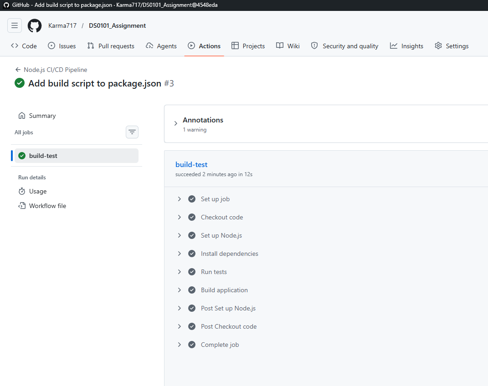

# Assignment 2: CI/CD Pipeline Using GitHub Actions

## Overview
This project uses GitHub Actions to create a CI/CD pipeline for the Node.js to-do application. The pipeline runs automatically when changes are pushed to the main branch.

## Reason for Using GitHub Actions
I first planned to use Jenkins for this assignment, but Jenkins was not letting me log in/access it properly. Because of that, I used GitHub Actions as an alternative CI/CD tool. GitHub Actions is directly connected to GitHub, so it was easier to set up and run the pipeline without installing or managing a Jenkins server.

## Pipeline Stages
1. Checkout source code from GitHub
2. Set up Node.js
3. Install dependencies using npm install
4. Run tests using npm test
5. Run the build step or confirm that no build step is required

## Challenges Faced
One challenge was that Jenkins was not letting me in, so I could not continue with the Jenkins setup. Another issue was that the project did not have a build script in package.json, so I updated the GitHub Actions workflow to handle the project correctly.

## Screenshot
The screenshot below shows the successful GitHub Actions pipeline run for the Node.js CI/CD workflow.

## Repository Link
https://github.com/Karma717/DSO101_Assignment.git
